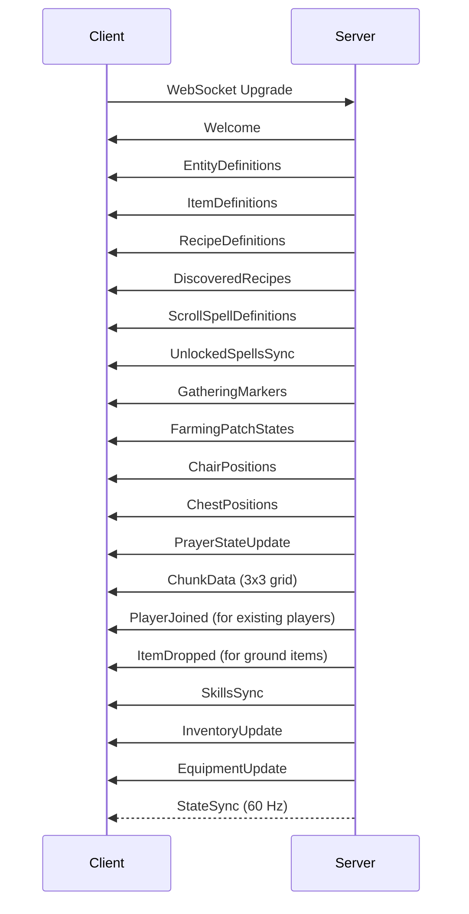

Aeven uses WebSocket connections with MessagePack binary serialization for real-time game communication.

## Connection Flow

### 1. HTTP Matchmaking Request

Before establishing a WebSocket connection, the client must obtain a session token through the matchmaking API.

```typescript
POST /api/matchmake/{room_name}
Authorization: Bearer {auth_token}
Content-Type: application/json

{
  "characterId": 12345
}
```

**Response:**
```json
{
  "room": {
    "roomId": "game_main",
    "name": "Main Game Room",
    "clients": 42
  },
  "sessionToken": "signed_jwt_token_here"
}
```

The session token is a cryptographically signed JWT that expires in 5 minutes and contains:
- `session_id` - Unique session identifier
- `room_id` - Room to connect to
- Expiration timestamp

See `rust-server/src/main.rs:1085-1530` for implementation.

### 2. WebSocket Upgrade

Connect to the WebSocket endpoint using the session token:

```
ws://game.server/{room_id}?sessionToken={session_token}
```

**Connection Steps:**

1. Client sends HTTP upgrade request with session token in query params
2. Server validates the signed token (`rust-server/src/main.rs:2834-2853`)
3. Server verifies session exists and matches room ID
4. Server upgrades connection to WebSocket
5. Server calls `handle_socket()` to initialize the game session

### 3. Session Initialization

Once the WebSocket connection is established, the server sends initialization messages in sequence:



See `rust-server/src/main.rs:2904-3200` for initialization sequence.

---

## Message Handling

### Client Send

Client encodes messages using the `encode_message` function:

```rust
pub fn encode_message<T: Serialize>(
    message_type: &str,
    data: &T,
) -> Result<Vec<u8>, rmp_serde::encode::Error> {
    // Colyseus expects: [13, "type", data]
    let message: (u8, &str, &T) = (Protocol::RoomData as u8, message_type, data);
    rmp_serde::to_vec(&message)
}
```

Example sending a move message:

```rust
let msg = ClientMessage::Move {
    dx: 1.0,
    dy: 0.0,
    seq: Some(42),
};

let (msg_type, msg_data) = msg.to_protocol();
let bytes = encode_message(msg_type, &msg_data)?;
ws_send(JsObject::buffer(&bytes));
```

See `client/src/network/wasm_client.rs:300-312`.

### Server Send

Server broadcasts messages to specific players or all players:

```rust
// Send to specific player
room.send_to_player(
    &player_id,
    ServerMessage::SkillXp {
        player_id: player_id.clone(),
        skill: "attack".to_string(),
        xp_gained: 100,
        total_xp: 1500,
        level: 15,
    },
)
.await;

// Broadcast to all overworld players
room.send_to_overworld_players(
    ServerMessage::PlayerJoined {
        id: player_id.clone(),
        name: "NewPlayer".to_string(),
        x: 100,
        y: 200,
        gender: "male".to_string(),
        skin: "tan".to_string(),
        hair_style: Some(1),
        hair_color: Some(2),
    },
    None, // Don't exclude anyone
)
.await;
```

### Client Receive

Client receives and decodes messages:

```rust
loop {
    let obj = ws_try_recv();
    if obj.is_nil() {
        break;
    }
    
    let mut buf = Vec::new();
    obj.to_byte_buffer(&mut buf);
    
    // Decompress if needed
    let decompressed = protocol::maybe_decompress(&buf)?;
    
    // Decode MessagePack
    let decoded = protocol::decode_message(&decompressed)?;
    
    // Handle message
    match decoded {
        DecodedMessage::RoomData { msg_type, data } => {
            message_handler::handle_room_data(&msg_type, data.as_ref(), state);
        }
        DecodedMessage::Error { code, message } => {
            log::error!("Server error {}: {}", code, message);
        }
        _ => {}
    }
}
```

See `client/src/network/wasm_client.rs:196-240`.

---

## State Synchronization

The server broadcasts `stateSync` messages at 60 Hz to all connected clients.

### StateSync Message Structure

```rust
ServerMessage::StateSync {
    tick: u64,              // Server tick number (increments at 60 Hz)
    players: Vec<PlayerUpdate>,
    npcs: Vec<NpcUpdate>,
    instance_id: String,    // Empty string = overworld
}
```

### PlayerUpdate Structure

```rust
struct PlayerUpdate {
    id: String,             // Player ID
    name: String,
    x: i32,                 // World X coordinate
    y: i32,                 // World Y coordinate
    direction: u8,          // Facing direction (0-7)
    vel_x: i32,             // Velocity X (-100 to 100)
    vel_y: i32,             // Velocity Y (-100 to 100)
    move_ack_seq: Option<u32>, // Client movement sequence acknowledgment
    hp: i32,
    max_hp: i32,
    combat_level: i32,
    // ... additional fields
}
```

### Client-Side Prediction

The client uses movement sequence numbers for client-side prediction:

1. Client sends `move` with `seq: 42`
2. Client predicts movement locally
3. Server processes movement and sends `stateSync` with `move_ack_seq: 42`
4. Client reconciles prediction with authoritative server position

See `client/src/network/wasm_client.rs:209-239` for deduplication logic.

---

## Compression

Messages support optional deflate compression to reduce bandwidth:

### Compression Format

- **0x00** prefix: Uncompressed MessagePack data follows
- **0x01** prefix: Deflate-compressed MessagePack data follows
- **No prefix**: Legacy uncompressed MessagePack

### Decompression Implementation

```rust
pub fn maybe_decompress(data: &[u8]) -> Result<Vec<u8>, String> {
    if data.is_empty() {
        return Err("Empty message".to_string());
    }
    
    match data[0] {
        0x00 => Ok(data[1..].to_vec()),
        0x01 => {
            let mut decoder = flate2::read::DeflateDecoder::new(&data[1..]);
            let mut decompressed = Vec::new();
            decoder.read_to_end(&mut decompressed)
                .map_err(|e| format!("Deflate decompression failed: {}", e))?;
            Ok(decompressed)
        }
        _ => Ok(data.to_vec()), // Legacy: no prefix
    }
}
```

See `client/src/network/protocol.rs:31-51`.

---

## Reconnection

The client implements automatic reconnection with exponential backoff:

### Reconnection Logic

```rust
const MAX_RECONNECT_ATTEMPTS: u32 = 3;

match self.connection_state {
    ConnectionState::Disconnected => {
        if self.was_connected {
            if self.reconnect_attempts >= MAX_RECONNECT_ATTEMPTS {
                log::error!("Failed to reconnect after {} attempts", MAX_RECONNECT_ATTEMPTS);
                state.reconnection_failed = true;
                return;
            }
            
            self.reconnect_timer += 1.0 / 60.0;
            if self.reconnect_timer > 2.0 {
                self.reconnect_attempts += 1;
                log::info!("Reconnection attempt {}/{}", self.reconnect_attempts, MAX_RECONNECT_ATTEMPTS);
                self.reconnect_timer = 0.0;
                self.start_matchmaking();
            }
        }
    }
    _ => {}
}
```

See `client/src/network/wasm_client.rs:136-165`.

### Session Takeover

If a player reconnects while already connected, the server performs a session takeover:

1. Server finds old session for the character ID
2. Server removes old session atomically
3. Server cleans up old player state (instances, room, etc.)
4. Server allows new connection to proceed

This prevents duplicate sessions and allows players to recover from network issues.

See `rust-server/src/main.rs:1188-1292` for implementation.

---

## Disconnection Cleanup

When a player disconnects, the server performs cleanup:

```rust
// 1. Remove from online characters set
state.online_characters.remove(&character_id);

// 2. Save character state to database
state.db.save_character(
    character_id,
    player.x,
    player.y,
    player.hp,
    // ... all character data
).await;

// 3. Remove from instance tracking
state.player_instances.write().await.remove(&player_id);

// 4. Unregister player sender (closes WebSocket send task)
room.unregister_player_sender(&player_id).await;

// 5. Remove from room
room.remove_player(&player_id).await;

// 6. Notify other players
room.send_to_overworld_players(
    ServerMessage::PlayerLeft { id: player_id },
    None,
).await;
```

---

## Error Handling

### Connection Errors

<ResponseField name="UNAUTHORIZED" type="401">
  Invalid or expired session token
</ResponseField>

<ResponseField name="FORBIDDEN" type="403">
  Token room_id mismatch or invalid session
</ResponseField>

<ResponseField name="TOO_MANY_REQUESTS" type="429">
  Rate limit exceeded for matchmaking
</ResponseField>

### Server Error Messages

The server sends error messages with codes:

```rust
ServerMessage::Error {
    code: u32,
    message: String,
}
```

Common error codes:
- `1000` - Authentication failed
- `2000` - Invalid request
- `3000` - Resource not found
- `5000` - Internal server error

---

## Performance Considerations

### Bandwidth Optimization

1. **Message Compression**: Use deflate compression for large messages
2. **StateSync Deduplication**: Client only processes latest stateSync per tick
3. **Differential Updates**: Only send changed data (e.g., InventoryUpdate sends changed slots)
4. **MessagePack Binary**: More compact than JSON

### StateSync Deduplication

The client deduplicates stateSync messages to prevent processing stale data:

```rust
let mut latest_state_sync: Option<(u64, DecodedMessage)> = None;

loop {
    let obj = ws_try_recv();
    if obj.is_nil() {
        break;
    }
    
    if let Some(tick) = extract_state_sync_tick(&decoded) {
        match &latest_state_sync {
            Some((existing_tick, _)) if tick <= *existing_tick => {
                // Skip older or same tick
            }
            _ => {
                latest_state_sync = Some((tick, decoded));
            }
        }
    }
}

// Process only the latest stateSync
if let Some((tick, decoded)) = latest_state_sync {
    self.handle_decoded_message(decoded, state);
}
```

See `client/src/network/wasm_client.rs:196-239`.

---

## Source References

- WebSocket handler: `rust-server/src/main.rs:2827-2902`
- Socket initialization: `rust-server/src/main.rs:2904-3200`
- Client connection: `client/src/network/wasm_client.rs:109-133`
- Client polling: `client/src/network/wasm_client.rs:135-246`
- Protocol encoding: `client/src/network/protocol.rs:20-51`
- Matchmaking API: `rust-server/src/main.rs:1085-1530`
