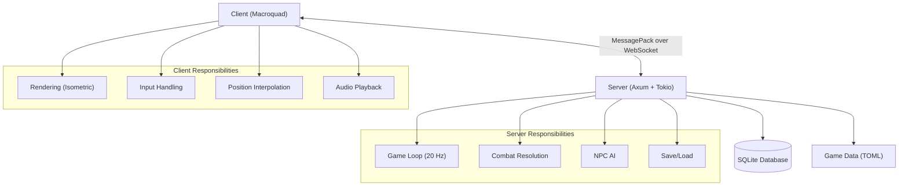
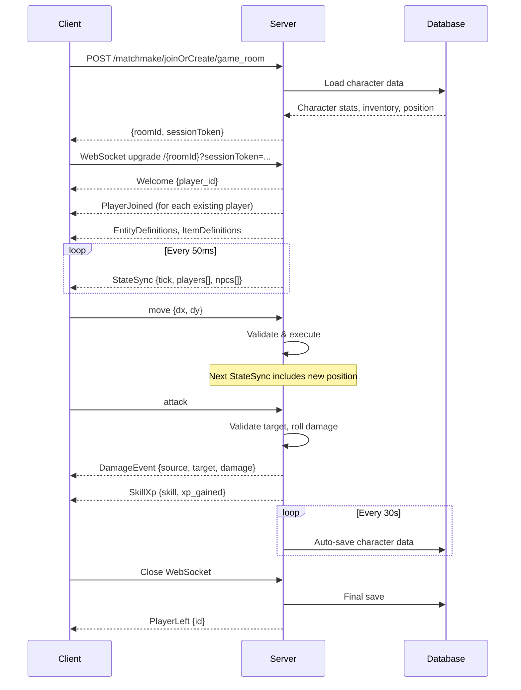

Aeven uses a client-server architecture with Rust on both sides, connected via WebSocket with MessagePack protocol.

## High-Level Architecture



## Core Principles

### Server-Authoritative

The server is the **single source of truth** for all game state:

- Player positions, HP, inventory, skills
- NPC states, combat, loot drops
- World state, chunk data, resource spawns

Clients only send **intents** (move, attack, use item). The server validates and executes them.

### Grid-Based Movement

Movement is tile-based with a 250ms cooldown per tile:

```rust
const MOVE_COOLDOWN_TICKS: u64 = 5;  // 5 ticks × 50ms = 250ms
```

Clients interpolate smoothly between grid positions for visual polish:

```rust
// Server: discrete tile positions
player.x = 10;  // i32 grid coordinate

// Client: interpolated visual position
player.visual_x = 10.3;  // f32, smoothly lerps to server position
```

### 20 Hz Tick Rate

The server runs at a fixed 20 ticks per second:

```rust
const TICK_RATE: f32 = 20.0;
```

Every 50ms, the server:
1. Processes movement, combat, NPC AI
2. Updates world state (respawns, item despawns)
3. Broadcasts `StateSync` message to all clients

### Chunk-Based World Streaming

The world is divided into 32×32 tile chunks. Clients request chunks as the player moves:

```rust
pub const CHUNK_SIZE: u32 = 32;  // 32x32 tiles per chunk
```

**Chunk lifecycle:**
1. Client detects player entered new chunk area
2. Send `RequestChunk { chunk_x, chunk_y }`
3. Server responds with `ChunkData` (layers, collision, objects)
4. Client caches and renders the chunk
5. Distant chunks are unloaded to save memory

## Technology Stack

| Component | Technology | Purpose |
|-----------|------------|----------|
| **Server Runtime** | Tokio | Async runtime for WebSocket handling |
| **Server Framework** | Axum | HTTP/WebSocket server |
| **Database** | SQLite + sqlx | Persistent storage for accounts, characters |
| **Client Framework** | Macroquad | Cross-platform game framework |
| **Protocol** | MessagePack | Compact binary serialization |
| **Quest Scripting** | Lua (mlua) | Dynamic quest logic |
| **Game Data** | TOML | Configuration for items, entities, recipes |
| **Map Editor** | React + TypeScript | Tiled-compatible map editor |

## Message Flow

Typical game session flow:



## State Management

### Server State

The server maintains shared state using `Arc` and `DashMap` for thread-safe concurrent access:

```rust
struct AppState {
    rooms: Arc<DashMap<String, Arc<GameRoom>>>,
    sessions: Arc<DashMap<String, GameSession>>,
    auth_sessions: Arc<DashMap<String, (i64, String)>>,
    db: Arc<Database>,
    // ... registries for entities, items, quests, etc.
}
```

Each `GameRoom` contains:

```rust
struct GameRoom {
    players: RwLock<HashMap<String, Player>>,
    npcs: RwLock<HashMap<String, Npc>>,
    ground_items: RwLock<HashMap<String, GroundItem>>,
    broadcast_tx: broadcast::Sender<ServerMessage>,
    // ...
}
```

### Client State

The client keeps a minimal snapshot of game state:

```rust
struct GameState {
    players: HashMap<String, Player>,
    npcs: HashMap<String, Npc>,
    ground_items: HashMap<String, GroundItem>,
    chunk_manager: ChunkManager,
    inventory: Inventory,
    local_player_id: Option<String>,
    // ...
}
```

The client **never** directly modifies authoritative state—it only interpolates visuals and sends input.

## Concurrency Model

### Server Concurrency

The server uses Tokio's async runtime with multiple concurrent tasks:

```rust
#[tokio::main]
async fn main() {
    // HTTP/WebSocket server task
    let server = axum::serve(listener, app).await;

    // Background tasks:
    tokio::spawn(game_tick_loop());      // 20 Hz game loop
    tokio::spawn(auto_save_loop());      // 30s auto-save
    tokio::spawn(metrics_loop());        // Performance monitoring
}
```

**Per-connection tasks** (spawned on WebSocket connect):
- **Send task**: Listens to broadcast channel, writes to WebSocket
- **Recv task**: Reads from WebSocket, decodes and dispatches messages

### Client Concurrency

The client is single-threaded (Macroquad main loop) but uses async networking:

```rust
#[macroquad::main]
async fn main() {
    loop {
        // 1. Poll network (non-blocking)
        network.poll(&mut game_state);

        // 2. Handle input
        let commands = input_handler.process(&game_state);

        // 3. Render
        renderer.render(&game_state);

        next_frame().await;
    }
}
```

## Data Flow Patterns

### Player Movement

1. **Client input**: WASD pressed → `InputCommand::Move { dx, dy }`
2. **Client sends**: `ClientMessage::Move { dx, dy, seq }`
3. **Server validates**: Check cooldown, collision, distance
4. **Server updates**: `player.x += dx; player.y += dy`
5. **Server broadcasts**: Next `StateSync` includes new position
6. **Client receives**: Updates `player.x`, interpolates `player.visual_x`

### Combat

1. **Client input**: Space pressed → `InputCommand::Attack`
2. **Client sends**: `ClientMessage::Attack`
3. **Server resolves**:
   - Find target in front of attacker
   - Roll hit chance based on attack vs defence
   - Roll damage based on strength + weapon bonus
   - Apply damage, check for death
4. **Server broadcasts**:
   - `DamageEvent { source, target, damage, hp }`
   - `SkillXp { skill: "attack", xp_gained }`
   - `NpcDied { id }` or `PlayerDied { id }` if killed
5. **Client receives**: Plays damage number animation, updates HP bar

### Inventory Updates

1. **Server event**: Pickup item, craft, loot drop, etc.
2. **Server updates**: Modify `player.inventory` HashMap
3. **Server sends**: `InventoryUpdate { slots: [...], gold }`
4. **Client receives**: Replaces entire inventory state

Inventory is **fully server-driven**—client never modifies it locally.

## Persistence Strategy

### Auto-Save (Every 30s)

```rust
tokio::spawn(async move {
    loop {
        tokio::time::sleep(Duration::from_secs(30)).await;
        for session in sessions.iter() {
            let save_data = room.get_player_save_data(&player_id).await;
            db.save_player(character_id, &save_data).await;
        }
    }
});
```

### Save on Disconnect

When a WebSocket closes, the server immediately saves:

```rust
let save_data = room.get_player_save_data(&player_id).await;
db.save_player(character_id, &save_data).await;
room.remove_player(&player_id).await;
```

### What Gets Saved

- **Position**: `x`, `y`, `current_map`, `entrance_x`, `entrance_y`
- **Stats**: `hp`, `prayer_points`, `mp`, `gold`
- **Skills**: All skill XP and levels (serialized as JSON)
- **Inventory**: Slot index, item ID, quantity (JSON array)
- **Bank**: Same as inventory (separate table)
- **Quest State**: Active quests, completed quests, objectives (JSON)
- **Equipment**: Equipped item IDs per slot
- **Slayer**: Current task, points, blocked monsters

## Security Considerations

### Authentication Flow

1. **Register/Login**: POST `/api/login` with username/password
2. **Password hashing**: Argon2 (server-side, never stored in plaintext)
3. **Session token**: UUID issued on successful login
4. **Token validation**: Required for matchmaking and WebSocket upgrade

### Signed Session Tokens

Matchmaking returns a **signed session token** to prevent WebSocket hijacking:

```rust
let token = hmac_sign(session_id, room_id, expiry);
// Expires in 5 minutes, must be used before timeout
```

### Server Validation

All client actions are validated:

- **Movement**: Cooldown, collision, distance checks
- **Combat**: Range, target validity, cooldown
- **Inventory**: Slot bounds, item existence, quantity limits
- **Crafting**: Recipe requirements, station proximity, skill level

Clients **cannot** cheat by sending invalid requests—the server is authoritative.

## Performance Optimization

### View Distance Culling

StateSync only includes entities within 40 tiles of the player:

```rust
const VIEW_DISTANCE: i32 = 40;

let in_range = (player.x - npc.x).abs() <= VIEW_DISTANCE
            && (player.y - npc.y).abs() <= VIEW_DISTANCE;
```

### MessagePack Compression

The protocol optionally compresses messages with deflate:

```rust
match data[0] {
    0x00 => uncompressed,
    0x01 => deflate_decompress(&data[1..]),
    _ => legacy_format,
}
```

### Client-Side Interpolation

To maintain smooth 60 FPS visuals with 20 Hz server updates, the client interpolates:

```rust
player.visual_x += (player.x as f32 - player.visual_x) * 0.3 * delta;
```

This creates buttery-smooth movement without increasing network traffic.
