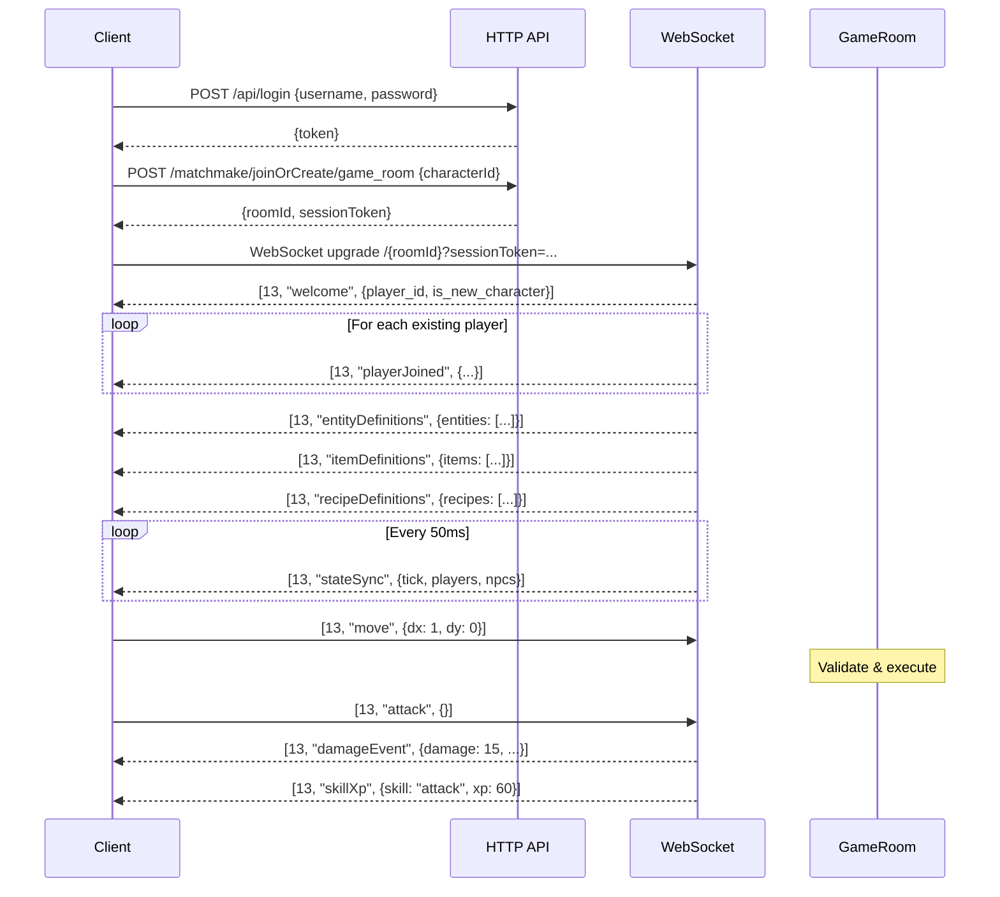

Aeven uses MessagePack over WebSocket for efficient binary communication between client and server.

## Protocol Overview

The protocol is based on Colyseus's message format:

```
[protocol_code, message_type, data]
```

- **protocol_code**: `u8` - Message category (13 = RoomData)
- **message_type**: `String` - Action name (e.g., "move", "attack")
- **data**: `Object` - MessagePack-encoded payload

### Example Message

```rust
// Client sends: Move { dx: 1.0, dy: 0.0 }
let msg = [13, "move", {"dx": 1.0, "dy": 0.0, "seq": 42}];
let bytes = rmp_serde::to_vec(&msg)?;
```

## Protocol Codes

From `client/src/network/protocol.rs:8`:

```rust
#[repr(u8)]
pub enum Protocol {
    Handshake = 9,        // Initial connection
    JoinRoom = 10,        // Join room request
    Error = 11,           // Server error
    LeaveRoom = 12,       // Leave room
    RoomData = 13,        // Game messages (most common)
    RoomState = 14,       // Full state snapshot
    RoomStatePatch = 15,  // State delta
}
```

**Most game messages use `RoomData (13)`.**

## Message Encoding

### Client → Server

From `client/src/network/protocol.rs:22`:

```rust
pub fn encode_message<T: Serialize>(
    message_type: &str,
    data: &T,
) -> Result<Vec<u8>, rmp_serde::encode::Error> {
    let message: (u8, &str, &T) = (Protocol::RoomData as u8, message_type, data);
    rmp_serde::to_vec(&message)
}
```

**Example:**

```rust
let msg = ClientMessage::Move { dx: 1.0, dy: 0.0, seq: Some(42) };
let bytes = encode_message("move", &msg)?;
websocket.send(&bytes);
```

### Server → Client

From `rust-server/src/protocol.rs:28` (in actual implementation):

```rust
pub fn encode_server_message(msg: &ServerMessage) -> Vec<u8> {
    use rmpv::Value;

    let msg_type = msg.msg_type();  // e.g., "stateSync"
    let data = rmp_serde::to_value(msg).unwrap();

    let frame = Value::Array(vec![
        Value::Integer(13.into()),
        Value::String(msg_type.into()),
        data,
    ]);

    rmpv::encode::write_value(&mut buf, &frame).unwrap();
    buf
}
```

## Compression

Messages can be optionally compressed with deflate:

```rust
pub fn maybe_decompress(data: &[u8]) -> Result<Vec<u8>, String> {
    if data.is_empty() {
        return Err("Empty message".to_string());
    }
    match data[0] {
        0x00 => Ok(data[1..].to_vec()),  // Uncompressed
        0x01 => {  // Deflate compressed
            let mut decoder = flate2::read::DeflateDecoder::new(&data[1..]);
            let mut decompressed = Vec::new();
            decoder.read_to_end(&mut decompressed)?;
            Ok(decompressed)
        }
        _ => Ok(data.to_vec()),  // Legacy: no prefix
    }
}
```

Compression is applied transparently by the server for large messages.

## Client Messages

From `rust-server/src/protocol.rs:12`:

```rust
#[derive(Debug, Clone, Deserialize)]
#[serde(tag = "type")]
pub enum ClientMessage {
    #[serde(rename = "move")]
    Move { dx: f32, dy: f32, seq: Option<u32> },

    #[serde(rename = "attack")]
    Attack,

    #[serde(rename = "chat")]
    Chat { text: String, channel: String },

    #[serde(rename = "pickup")]
    Pickup { item_id: String },

    #[serde(rename = "useItem")]
    UseItem { slot_index: u8 },

    #[serde(rename = "equip")]
    Equip { slot_index: u8 },

    #[serde(rename = "startCraft")]
    StartCraft { recipe_id: String },

    #[serde(rename = "chopTree")]
    ChopTree { tree_x: i32, tree_y: i32, tree_gid: u32 },

    #[serde(rename = "mineRock")]
    MineRock { rock_x: i32, rock_y: i32, rock_gid: u32 },

    // ... 50+ message types (see protocol.rs:12-390)
}
```

### Common Client Messages

| Message | Fields | Purpose |
|---------|--------|----------|
| `move` | `dx`, `dy`, `seq` | Move player (cardinal directions) |
| `attack` | - | Attack in facing direction |
| `target` | `entity_id` | Set target NPC |
| `chat` | `text`, `channel` | Send chat message |
| `pickup` | `item_id` | Pick up ground item |
| `useItem` | `slot_index` | Use inventory item |
| `equip` | `slot_index` | Equip item from inventory |
| `startCraft` | `recipe_id` | Begin crafting |
| `interact` | `npc_id` | Talk to NPC |
| `requestChunk` | `chunk_x`, `chunk_y` | Request world chunk |

## Server Messages

From `rust-server/src/protocol.rs:542`:

```rust
#[derive(Debug, Clone, Serialize)]
#[serde(untagged)]
pub enum ServerMessage {
    Welcome {
        player_id: String,
        is_new_character: bool,
    },

    PlayerJoined {
        id: String,
        name: String,
        x: i32,
        y: i32,
        gender: String,
        skin: String,
        // ...
    },

    StateSync {
        tick: u64,
        players: Vec<PlayerUpdate>,
        npcs: Vec<NpcUpdate>,
        instance_id: String,
    },

    DamageEvent {
        source_id: String,
        target_id: String,
        damage: i32,
        target_hp: i32,
        target_x: f32,
        target_y: f32,
        projectile: Option<String>,
    },

    InventoryUpdate {
        player_id: String,
        slots: Vec<InventorySlotUpdate>,
        gold: i32,
    },

    // ... 100+ message types (see protocol.rs:542-1318)
}
```

### Critical Server Messages

| Message | Frequency | Purpose |
|---------|-----------|----------|
| `StateSync` | Every 50ms | Broadcast all entity positions/HP |
| `DamageEvent` | On hit | Combat damage with visuals |
| `InventoryUpdate` | On change | Replace entire inventory |
| `SkillXp` | On gain | XP drop with skill type |
| `ChatMessage` | On send | Player chat message |
| `ItemDropped` | On drop | Spawn ground item |
| `ChunkData` | On request | Send map chunk data |

## Connection Flow



## Message Dispatch (Client)

From `client/src/network/mod.rs` (conceptual):

```rust
impl NetworkClient {
    pub fn poll(&mut self, state: &mut GameState) {
        while let Some(msg) = self.ws.try_recv() {
            let decoded = decode_message(&msg);
            self.handle_message(decoded, state);
        }
    }

    fn handle_message(&mut self, msg: DecodedMessage, state: &mut GameState) {
        match msg {
            DecodedMessage::RoomData { msg_type, data } => {
                match msg_type.as_str() {
                    "stateSync" => self.handle_state_sync(data, state),
                    "damageEvent" => self.handle_damage(data, state),
                    "inventoryUpdate" => self.handle_inventory(data, state),
                    "chatMessage" => self.handle_chat(data, state),
                    // ... 100+ handlers
                    _ => warn!("Unknown message: {}", msg_type),
                }
            }
        }
    }
}
```

## Message Dispatch (Server)

From `rust-server/src/main.rs:1700` (conceptual):

```rust
async fn handle_socket(ws: WebSocket, session: GameSession, room: Arc<GameRoom>) {
    let (mut tx, mut rx) = ws.split();

    // Recv task: decode and dispatch
    while let Some(Ok(msg)) = rx.next().await {
        let bytes = msg.into_data();
        let client_msg = decode_client_message(&bytes);

        match client_msg {
            ClientMessage::Move { dx, dy, seq } => {
                room.handle_move(&session.player_id, dx, dy, seq).await;
            }
            ClientMessage::Attack => {
                room.handle_attack(&session.player_id).await;
            }
            ClientMessage::Pickup { item_id } => {
                room.handle_pickup(&session.player_id, &item_id).await;
            }
            // ... dispatch all message types
        }
    }
}
```

## StateSync Format

The most frequent message (`StateSync`) is optimized for size:

```rust
ServerMessage::StateSync {
    tick: 12345,  // Server tick number
    players: vec![
        PlayerUpdate {
            id: "char_42",
            x: 15,
            y: 20,
            direction: 2,  // Direction::Down
            hp: 85,
            max_hp: 100,
            animation: "walk",
        },
        // ...
    ],
    npcs: vec![
        NpcUpdate {
            id: "npc_goblin_1",
            x: 18,
            y: 22,
            direction: 0,
            hp: 30,
            max_hp: 30,
            state: "chasing",
        },
        // ...
    ],
    instance_id: "overworld",  // Map context (prevents stale updates)
}
```

**Size optimization**: Only players/NPCs within 40 tiles are included.

## Error Handling

The server sends error messages for invalid actions:

```rust
ServerMessage::Error {
    code: 400,
    message: "Cannot equip: item is not equippable".to_string(),
}
```

**Common error codes**:
- `400`: Invalid request (client bug or cheating attempt)
- `403`: Action forbidden (cooldown, requirements not met)
- `404`: Entity not found (item, NPC, chunk)
- `500`: Server error (rare, logged for debugging)

## Performance Considerations

### MessagePack vs JSON

MessagePack is ~30% smaller than JSON for typical game messages:

```
JSON StateSync:  ~2.5 KB
MessagePack:     ~1.7 KB
```

### Compression Threshold

Deflate compression is applied for messages > 512 bytes:

```rust
let bytes = encode_message(msg);
if bytes.len() > 512 {
    let compressed = deflate(&bytes);
    send([0x01, compressed]);
} else {
    send([0x00, bytes]);
}
```

### Bandwidth Usage

Typical bandwidth for one player:

- **Downstream** (server → client): ~15 KB/s
  - StateSync (20 Hz): ~1.5 KB × 20 = 30 KB/s (before culling)
  - View distance culling: ~50% reduction → 15 KB/s
- **Upstream** (client → server): ~0.5 KB/s
  - Move commands (20 Hz): ~30 bytes × 20 = 600 bytes/s

## Sequence Numbers

Move commands include optional sequence numbers for client prediction:

```rust
ClientMessage::Move { dx, dy, seq: Some(42) }
```

The client tracks the last acknowledged sequence to detect desyncs.

## Ping/Pong

The client can measure latency:

```rust
// Client sends
ClientMessage::Ping { timestamp: 123456789.0 }

// Server echoes
ServerMessage::Pong { timestamp: 123456789.0 }

// Client calculates RTT
let rtt = now() - timestamp;
```

## Message Validation

The server validates all client messages:

```rust
match client_msg {
    ClientMessage::Move { dx, dy, .. } => {
        // Normalize to -1, 0, 1
        let dx = dx.signum() as i32;
        let dy = dy.signum() as i32;

        // Reject diagonal moves
        if dx != 0 && dy != 0 {
            send_error("Diagonal movement not allowed");
            return;
        }

        // Check cooldown
        if last_move.elapsed() < Duration::from_millis(250) {
            // Silently ignore (client is sending too fast)
            return;
        }

        // Proceed with move
    }
}
```

**Clients cannot cheat** by sending invalid data—the server is authoritative.

## Reconnection Handling

On disconnect, the client attempts to reconnect:

```rust
if ws.is_closed() {
    // Wait 1 second, then reconnect
    tokio::time::sleep(Duration::from_secs(1)).await;
    self.reconnect();
}
```

The server preserves player state during brief disconnects (30s timeout).

## Message Reference

For a complete list of all message types, see:
- **Client → Server**: `rust-server/src/protocol.rs:12-390`
- **Server → Client**: `rust-server/src/protocol.rs:542-1318`

The protocol includes messages for:
- Movement, combat, targeting
- Inventory, equipment, banking
- Crafting, gathering, skills
- Quests, dialogue, shops
- Friends, trading, chat
- Slayer, prayer, spells
- Farming, woodcutting, mining
- Instances, portals, arenas
