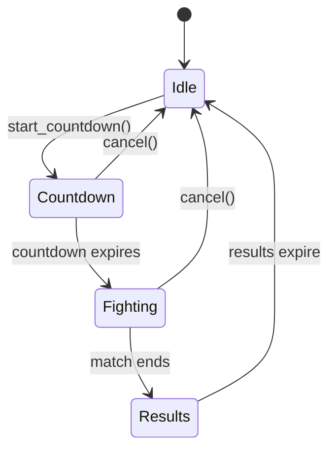

The Arena system provides structured PvP combat with automatic matchmaking, multiple ring configurations, entry fees, spectator zones, and reward distribution.

## System overview

The arena operates as a state machine with distinct phases:

<Steps>
  <Step title="Queue phase (Idle)">
    Players enter the queue zone and pay the entry fee to join. The system accepts players until a match is triggered.
  </Step>
  
  <Step title="Countdown phase">
    Once enough players queue (minimum 2), a countdown begins. The appropriate ring is selected based on player count.
  </Step>
  
  <Step title="Fighting phase">
    Players spawn at designated positions and combat begins. Eliminations are tracked, and defeated players become spectators.
  </Step>
  
  <Step title="Results phase">
    Match concludes when one or zero fighters remain. Rewards are distributed, placements announced, then the system resets to idle.
  </Step>
</Steps>

## Arena configuration

The arena is configured with zones, rings, fees, and timing parameters:

```rust arena.rs
pub struct ArenaConfig {
    pub map_id: String,
    pub entry_fee: i32,
    pub countdown_duration_ms: u64,
    pub results_duration_ms: u64,
    pub queue_zone: ZoneBounds,
    pub rings: Vec<RingConfig>,
}
```

### Default settings

The default configuration includes:

- **Map ID**: `duel_arena`
- **Entry fee**: 50 gold
- **Countdown duration**: 10 seconds (10,000 ms)
- **Results display**: 10 seconds (10,000 ms)
- **Queue zone**: Coordinates (13,2) to (30,13)

<Note>
Entry fees are held in escrow during the match and distributed as rewards to winners based on placement.
</Note>

## Ring configurations

The arena supports multiple ring types that are automatically selected based on queue size. Rings are sorted by capacity, and the system picks the smallest ring that fits the current player count.

### 1v1 Ring

Small ring designed for duels between two players.

```rust arena.rs
RingConfig {
    name: "1v1 Ring".to_string(),
    max_players: 2,
    ring_zone: ZoneBounds {
        min_x: 3,
        min_y: 3,
        max_x: 11,
        max_y: 11,
    },
    spectator_zone: ZoneBounds {
        min_x: 3,
        min_y: 12,
        max_x: 11,
        max_y: 13,
    },
    ring_spawn_points: vec![(5, 5), (9, 9)],
    spectator_spawn: (7, 12),
}
```

**Specifications:**
- Combat area: 9x9 tiles
- Spawn points: Diagonal corners at (5,5) and (9,9)
- Spectator zone: 2-tile strip below the ring
- Spectator spawn: Centered at (7,12)

### FFA Ring

Larger ring for free-for-all matches with up to 8 players.

```rust arena.rs
RingConfig {
    name: "FFA Ring".to_string(),
    max_players: 8,
    ring_zone: ZoneBounds {
        min_x: 15,
        min_y: 15,
        max_x: 29,
        max_y: 29,
    },
    spectator_zone: ZoneBounds {
        min_x: 13,
        min_y: 14,
        max_x: 30,
        max_y: 14,
    },
    ring_spawn_points: vec![
        (17, 19), (27, 19), (22, 17), (22, 27),
        (17, 17), (27, 17), (17, 27), (27, 27),
    ],
    spectator_spawn: (22, 14),
}
```

**Specifications:**
- Combat area: 15x15 tiles
- 8 predefined spawn points distributed evenly
- Spectator zone: Single-tile strip north of the ring
- Spectator spawn: Centered at (22,14)

### Ring selection logic

The system automatically selects the appropriate ring:

```rust arena.rs:211
fn select_ring(&self, player_count: usize) -> usize {
    // Rings are sorted by max_players ascending in the default config.
    // Find the first ring that fits.
    for (i, ring) in self.config.rings.iter().enumerate() {
        if player_count <= ring.max_players {
            return i;
        }
    }
    // Fallback: largest ring (last one)
    self.config.rings.len().saturating_sub(1)
}
```

<Info>
If the queue exceeds the largest ring's capacity, the system uses the largest available ring and assigns spawn points cyclically.
</Info>

## Queue system

### Joining the queue

Players join by entering the queue zone. The system validates gold balance and arena state:

```rust arena.rs:261
pub fn queue_player(
    &mut self,
    player_id: &str,
    player_name: &str,
    gold: i32,
) -> Result<(), String> {
    if self.state != ArenaState::Idle {
        return Err("Arena is not accepting new players right now.".to_string());
    }

    if self.queued_players.contains(&player_id.to_string()) {
        return Err("You are already in the queue.".to_string());
    }

    if gold < self.config.entry_fee {
        return Err(format!(
            "Not enough gold. Entry fee is {} but you only have {}.",
            self.config.entry_fee, gold
        ));
    }

    self.queued_players.push(player_id.to_string());
    // ... name tracking and arena player list updates
    Ok(())
}
```

**Queue validation:**
- Arena must be in Idle state
- Player not already queued
- Sufficient gold for entry fee

### Queue requirements

<Warning>
A minimum of 2 players must be queued before a countdown can begin. Attempting to start with fewer players returns an error.
</Warning>

### Leaving the queue

Players can leave the queue before the countdown starts. Any escrowed gold is refunded:

```rust arena.rs:294
pub fn dequeue_player(&mut self, player_id: &str) -> Option<i32> {
    self.queued_players.retain(|id| id != player_id);
    self.all_arena_players.retain(|id| id != player_id);
    self.match_stats.fighter_names.remove(player_id);
    self.escrow.remove(player_id)
}
```

## Entry fees and escrow

Entry fees are collected when the countdown starts and held in escrow until match completion.

### Fee collection

```rust arena.rs:336
let mut charges: Vec<(String, i32)> = Vec::new();
for pid in &self.queued_players {
    self.escrow.insert(pid.clone(), self.config.entry_fee);
    charges.push((pid.clone(), self.config.entry_fee));
}
```

The `start_countdown` method returns a list of charge transactions that the game room executes, deducting gold from each player.

### Configurable fees

Administrators can adjust entry fees dynamically:

```rust arena.rs:499
pub fn set_entry_fee(&mut self, fee: i32) {
    self.config.entry_fee = fee;
}
```

<Tip>
Setting entry fees to 0 creates a free-to-enter arena suitable for practice or community events.
</Tip>

## Countdown phase

### Starting the countdown

When the queue reaches the minimum threshold, a countdown can be triggered:

```rust arena.rs:305
pub fn start_countdown(
    &mut self,
    current_time: u64,
    custom_duration_ms: Option<u64>,
) -> Result<Vec<(String, i32)>, String> {
    if self.state != ArenaState::Idle {
        return Err("Arena is not idle.".to_string());
    }
    if self.queued_players.len() < 2 {
        return Err("Need at least 2 players to start.".to_string());
    }

    // Select ring based on queue size
    self.active_ring_index = Some(self.select_ring(self.queued_players.len()));

    let ring = &self.config.rings[self.active_ring_index.unwrap()];
    tracing::info!(
        "Arena: selected '{}' for {} players (max {})",
        ring.name,
        self.queued_players.len(),
        ring.max_players
    );

    let duration = custom_duration_ms.unwrap_or(self.config.countdown_duration_ms);
    let ends_at = current_time + duration;

    // Collect entry fees...
    self.state = ArenaState::Countdown { ends_at };
    Ok(charges)
}
```

### Custom countdown durations

The `custom_duration_ms` parameter allows overriding the default 10-second countdown for testing or special events.

## Combat mechanics

### Spawn assignment

When the countdown expires, fighters are teleported to spawn points:

```rust arena.rs:345
pub fn start_fight(&mut self) -> Vec<(String, (i32, i32))> {
    self.active_fighters = self.queued_players.clone();
    self.queued_players.clear();

    self.match_stats.kills.clear();
    self.match_stats.death_order.clear();
    for pid in &self.active_fighters {
        self.match_stats.kills.insert(pid.clone(), 0);
    }

    let ring = &self.config.rings[self.active_ring_index.unwrap_or(0)];
    let spawns = &ring.ring_spawn_points;
    let assignments: Vec<(String, (i32, i32))> = self
        .active_fighters
        .iter()
        .enumerate()
        .map(|(i, pid)| {
            let point = spawns[i % spawns.len()];
            (pid.clone(), point)
        })
        .collect();

    self.state = ArenaState::Fighting;
    assignments
}
```

If player count exceeds spawn points, assignments cycle using modulo (`i % spawns.len()`).

### Death tracking

The arena tracks eliminations and attributions:

```rust arena.rs:375
pub fn on_player_death(&mut self, player_id: &str, killer_id: Option<&str>) {
    if let Some(kid) = killer_id {
        *self.match_stats.kills.entry(kid.to_string()).or_insert(0) += 1;
    }

    if !self
        .match_stats
        .death_order
        .contains(&player_id.to_string())
    {
        self.match_stats.death_order.push(player_id.to_string());
    }

    self.active_fighters.retain(|id| id != player_id);
    if !self.spectators.contains(&player_id.to_string()) {
        self.spectators.push(player_id.to_string());
    }
}
```

**Tracking details:**
- Killer's kill count incremented (if killer provided)
- Death order recorded for placement calculation
- Eliminated player removed from active fighters
- Eliminated player added to spectator list

### Match end condition

The match ends when one or zero fighters remain:

```rust arena.rs:394
pub fn check_match_end(&self) -> bool {
    self.active_fighters.len() <= 1
}
```

## Spectator zones

### Spectator mechanics

When a player dies during a match, they're automatically moved to the spectator zone:

<Steps>
  <Step title="Death processing">
    Player is removed from `active_fighters` and added to `spectators` list.
  </Step>
  
  <Step title="Zone teleport">
    Player is teleported to the active ring's spectator spawn point.
  </Step>
  
  <Step title="Spectator restrictions">
    Spectators can watch the match but cannot interfere with combat.
  </Step>
</Steps>

### Spectator spawn retrieval

```rust arena.rs:489
pub fn active_spectator_spawn(&self) -> (i32, i32) {
    self.active_ring()
        .map(|r| r.spectator_spawn)
        .unwrap_or((16, 4))
}
```

If no active ring exists (edge case), defaults to coordinates (16, 4).

## Rewards and placements

### Placement calculation

Rankings are determined by survival order:

```rust arena.rs:398
pub fn end_match(&mut self, current_time: u64) -> Vec<ArenaPlacement> {
    let total_pot: i32 = self.escrow.values().sum();
    let num_entrants = self.escrow.len();

    let mut ranked_ids: Vec<String> = Vec::new();

    // Winner (last survivor)
    if let Some(winner) = self.active_fighters.first() {
        ranked_ids.push(winner.clone());
    }

    // Remaining places by reverse death order
    for pid in self.match_stats.death_order.iter().rev() {
        ranked_ids.push(pid.clone());
    }

    let payouts = Self::calculate_payouts(total_pot, num_entrants, ranked_ids.len());
    // ... placement assembly
}
```

**Ranking logic:**
1. First place: Last surviving fighter
2. Subsequent places: Reverse death order (last to die = 2nd place)

### Payout distribution

Rewards scale based on the number of entrants:

```rust arena.rs:571
fn calculate_payouts(total_pot: i32, num_entrants: usize, num_ranked: usize) -> Vec<i32> {
    if num_ranked == 0 {
        return Vec::new();
    }

    if num_entrants <= 2 {
        // Winner takes all
        let mut payouts = vec![total_pot];
        for _ in 1..num_ranked {
            payouts.push(0);
        }
        return payouts;
    }

    // 3+ players: 60% / 25% / 15%
    let first = (total_pot as f64 * 0.60).floor() as i32;
    let second = (total_pot as f64 * 0.25).floor() as i32;
    let third = (total_pot as f64 * 0.15).floor() as i32;
    let remainder = total_pot - first - second - third;
    let first = first + remainder;

    let mut payouts = Vec::with_capacity(num_ranked);
    for i in 0..num_ranked {
        match i {
            0 => payouts.push(first),
            1 => payouts.push(second),
            2 => payouts.push(third),
            _ => payouts.push(0),
        }
    }
    payouts
}
```

<Columns cols={2}>
  <Card title="2-player matches" icon="user">
    Winner takes 100% of the pot. Loser receives nothing.
  </Card>
  
  <Card title="3+ player matches" icon="users">
    Top 3 split rewards:
    - 1st place: 60%
    - 2nd place: 25%
    - 3rd place: 15%
  </Card>
</Columns>

<Note>
Any rounding remainder from percentage calculations is added to first place to ensure the full pot is distributed.
</Note>

### Placement structure

Each placement includes comprehensive match statistics:

```rust arena.rs:147
pub struct ArenaPlacement {
    pub rank: u32,
    pub player_id: String,
    pub player_name: String,
    pub kills: i32,
    pub gold_reward: i32,
}
```

## Leaderboards

### Match statistics

The arena tracks detailed combat statistics during each match:

```rust arena.rs:160
pub struct MatchStats {
    pub kills: HashMap<String, i32>,
    pub death_order: Vec<String>,
    pub fighter_names: HashMap<String, String>,
}
```

**Tracked metrics:**
- **Kills**: Individual kill counts for each fighter
- **Death order**: Sequential elimination order for placement
- **Fighter names**: Player name mapping for results display

### Results phase

After match completion, results are displayed for a configured duration:

```rust arena.rs:437
self.state = ArenaState::Results {
    ends_at: current_time + self.config.results_duration_ms,
};
```

During this phase, placements are broadcasted via `ArenaEvent::MatchEnded` with the full placement array containing ranks, names, kills, and rewards.

<Tip>
The results duration (default 10 seconds) gives players time to review match statistics before the arena resets.
</Tip>

## State management

### Arena states

The arena operates as a finite state machine:

```rust arena.rs:123
pub enum ArenaState {
    Idle,
    Countdown { ends_at: u64 },
    Fighting,
    Results { ends_at: u64 },
}
```

### State transitions



### Status text

The system provides human-readable status messages:

```rust arena.rs:513
pub fn get_status_text(&self) -> String {
    match &self.state {
        ArenaState::Idle => {
            let queued = self.queued_players.len();
            format!(
                "Arena is idle. {} player{} queued. Entry fee: {} gold.",
                queued,
                if queued == 1 { "" } else { "s" },
                self.config.entry_fee
            )
        }
        ArenaState::Countdown { ends_at } => {
            let ring_name = self.active_ring().map(|r| r.name.as_str()).unwrap_or("unknown");
            format!(
                "Fight starting in {}! {} fighters → {}.",
                ends_at,
                self.queued_players.len(),
                ring_name
            )
        }
        ArenaState::Fighting => {
            let ring_name = self.active_ring().map(|r| r.name.as_str()).unwrap_or("unknown");
            format!(
                "Fight in progress ({})! {} fighter{} remaining.",
                ring_name,
                self.active_fighters.len(),
                if self.active_fighters.len() == 1 { "" } else { "s" }
            )
        }
        ArenaState::Results { .. } => "Match complete. Results on display.".to_string(),
    }
}
```

## Events system

### Arena events

The arena emits events that the game room handles:

```rust arena.rs:135
pub enum ArenaEvent {
    StateChanged { state: String },
    FightStarted { fighters: Vec<(String, (i32, i32))> },
    MatchEnded { placements: Vec<ArenaPlacement> },
    ResultsExpired,
}
```

**Event types:**
- **StateChanged**: Arena transitions to a new state
- **FightStarted**: Combat begins with spawn assignments
- **MatchEnded**: Match concludes with placements and rewards
- **ResultsExpired**: Results period ended, arena resetting

### Event timing

The `tick` method processes time-based state transitions:

```rust arena.rs:227
pub fn tick(&mut self, current_time: u64) -> Vec<ArenaEvent> {
    let mut events = Vec::new();

    match self.state.clone() {
        ArenaState::Countdown { ends_at } => {
            if current_time >= ends_at {
                let spawn_assignments = self.start_fight();
                events.push(ArenaEvent::StateChanged {
                    state: "fighting".to_string(),
                });
                events.push(ArenaEvent::FightStarted {
                    fighters: spawn_assignments,
                });
            }
        }
        ArenaState::Results { ends_at } => {
            if current_time >= ends_at {
                self.reset_to_idle();
                events.push(ArenaEvent::ResultsExpired);
                events.push(ArenaEvent::StateChanged {
                    state: "idle".to_string(),
                });
            }
        }
        _ => {}
    }

    events
}
```

The game room should call `tick` regularly (e.g., every game update) to process automatic transitions.

## Disconnection handling

### Mid-match disconnections

Players who disconnect during combat are treated as eliminations:

```rust arena.rs:455
pub fn on_player_disconnect(&mut self, player_id: &str) -> Option<(String, Option<String>)> {
    let was_fighting = self.active_fighters.contains(&player_id.to_string());

    self.queued_players.retain(|id| id != player_id);
    self.spectators.retain(|id| id != player_id);
    self.all_arena_players.retain(|id| id != player_id);

    if was_fighting {
        self.on_player_death(player_id, None);
        Some((player_id.to_string(), None))
    } else {
        self.escrow.remove(player_id);
        None
    }
}
```

**Disconnection behavior:**
- If fighting: Counted as death with no killer attribution
- If queued/spectating: Removed from lists, escrow refunded
- Entry fee is forfeited if disconnection occurs during combat

<Warning>
Disconnecting during a fight counts as a loss. The player's entry fee remains in the pot and is distributed to survivors.
</Warning>

## Match cancellation

### Administrative cancel

Administrators can cancel an ongoing match, refunding all entry fees:

```rust arena.rs:445
pub fn cancel(&mut self) -> Vec<(String, i32)> {
    let refunds: Vec<(String, i32)> = self.escrow.drain().collect();
    self.reset_to_idle();
    refunds
}
```

All escrowed gold is returned, and the arena resets to idle state.

## Zone utilities

### Zone boundary checks

The arena provides zone detection methods:

```rust arena.rs:475
pub fn is_in_queue_zone(&self, x: i32, y: i32) -> bool {
    self.config.queue_zone.contains(x, y)
}
```

```rust arena.rs:484
pub fn active_ring_zone(&self) -> Option<&ZoneBounds> {
    self.active_ring().map(|r| &r.ring_zone)
}
```

**Zone bounds structure:**

```rust arena.rs:8
pub struct ZoneBounds {
    pub min_x: i32,
    pub min_y: i32,
    pub max_x: i32,
    pub max_y: i32,
}

impl ZoneBounds {
    pub fn contains(&self, x: i32, y: i32) -> bool {
        x >= self.min_x && x <= self.max_x && y >= self.min_y && y <= self.max_y
    }
}
```

<Info>
Zone bounds use inclusive coordinates. A zone from (3,3) to (11,11) includes both endpoints.
</Info>

## Best practices

<AccordionGroup>
  <Accordion title="Entry fee tuning">
    - Start with moderate fees (50-100 gold) to balance accessibility and stakes
    - Consider player economy when adjusting fees
    - Use free arenas (0 gold) for practice or community events
    - Higher fees create more competitive matches with larger rewards
  </Accordion>

  <Accordion title="Ring configuration">
    - Sort rings by `max_players` in ascending order for optimal selection
    - Provide enough spawn points for the maximum capacity
    - Design spectator zones with clear sightlines to the combat area
    - Ensure spawn points are equidistant to prevent unfair positioning
  </Accordion>

  <Accordion title="Match pacing">
    - Default 10-second countdown provides adequate preparation time
    - Shorten countdown for experienced players or quick-start events
    - Lengthen results display for tournaments to allow screenshot capture
    - Balance match frequency with player availability
  </Accordion>

  <Accordion title="Disconnection policies">
    - Clearly communicate disconnection penalties to players
    - Consider grace period reconnection for network issues (future feature)
    - Monitor disconnection patterns to identify technical problems
    - Log disconnections for potential abuse detection
  </Accordion>
</AccordionGroup>

## Integration example

Here's a typical integration flow with the game room:

<CodeGroup>

```rust Initialize arena
use crate::arena::{ArenaConfig, ArenaManager};

let config = ArenaConfig::default();
let mut arena = ArenaManager::new(config);
```

```rust Player enters queue
match arena.queue_player(&player_id, &player_name, player_gold) {
    Ok(()) => {
        send_message(&player_id, "You joined the arena queue!");
    }
    Err(e) => {
        send_message(&player_id, &format!("Cannot queue: {}", e));
    }
}
```

```rust Start countdown
let current_time = get_current_time_ms();
match arena.start_countdown(current_time, None) {
    Ok(charges) => {
        for (player_id, fee) in charges {
            deduct_gold(&player_id, fee);
        }
        broadcast_event("Arena countdown started!");
    }
    Err(e) => {
        log::error!("Failed to start countdown: {}", e);
    }
}
```

```rust Process tick
let events = arena.tick(get_current_time_ms());
for event in events {
    match event {
        ArenaEvent::FightStarted { fighters } => {
            for (player_id, (x, y)) in fighters {
                teleport_player(&player_id, x, y);
            }
        }
        ArenaEvent::MatchEnded { placements } => {
            for placement in placements {
                award_gold(&placement.player_id, placement.gold_reward);
                update_leaderboard(&placement);
            }
            display_results(&placements);
        }
        ArenaEvent::ResultsExpired => {
            broadcast_event("Arena is open for new challengers!");
        }
        _ => {}
    }
}
```

```rust Handle death
if player_died_in_arena {
    arena.on_player_death(&victim_id, Some(&killer_id));
    
    // Teleport to spectator zone
    let spawn = arena.active_spectator_spawn();
    teleport_player(&victim_id, spawn.0, spawn.1);
    
    // Check if match should end
    if arena.check_match_end() {
        let placements = arena.end_match(get_current_time_ms());
        // Process placements...
    }
}
```

</CodeGroup>

## Related systems

<CardGroup cols={2}>
  <Card title="Combat mechanics" icon="sword" href="/features/combat">
    Learn about the underlying combat system that powers arena battles.
  </Card>
  
  <Card title="Items & Equipment" icon="shield" href="/features/items">
    Manage your gold and understand rewards from arena victories.
  </Card>
  
  <Card title="Multiplayer" icon="users" href="/features/multiplayer">
    Understand player interactions and PvP mechanics.
  </Card>
  
  <Card title="Skills" icon="graduation-cap" href="/features/skills">
    Learn how combat levels affect arena matchmaking.
  </Card>
</CardGroup>
